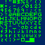
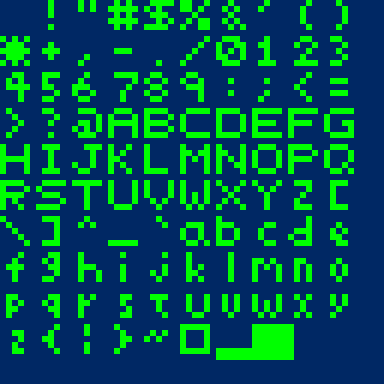

Five-Pixel-Font Library
=======================

This is a header-only library in pure C. It contains a whole ASCII font inside a single header file. It's handy for debugging since it doesn't require loading any external font resources. Also, it can be used to quickly add text output to a new graphics engine before putting in the effort for TrueType or custom font rendering. Finally, since the font was originally designed for MCGA mode graphics (320x200) it works on very small displays.

The library creates a texture atlas of font glyphs in a client buffer. The texture atlas is a single channel (8-bit) alpha texture. The client application then uses the library to calculate texture coordinates for individual glyphs while rendering text.

The library itself contains around 430 bytes of font data. The texture atlas created by the library is a single channel (8-bit) 64x64 texture which works out to use 4KB of video memory.

Each glyph is 5x5 texels. However, there is a space on the right and bottom of each glyph so that they can be rendered into 6x6 pixel character cells without worrying about kerning. So it works like this: render a character, then advance six pixels and render the next character.

What the font (and texture atlas) looks like:



And at 6x size:



Portability
-----------

There's nothing particularly platform specific about the library. However, the scope of testing has been limited. It's been tested with Microsoft Visual C v11.0 and Clang v3.2 (OS X). By default it includes `<memory.h>` (for `memset()`) and `<assert.h>`. The defaults can be overridden.

Including the Library
---------------------

The header file (`"five_pixel_font.h"`) may be included in multiple source files. However, `FPF_IMPLEMENTATION` should be defined in a single source file before including `"five_pixel_font.h"`. Defining `FPF_IMPLEMENTATION` causes the library code to be expanded in that translation unit. For example:

```C
    #define FPF_IMPLEMENTATION
    #include "five_pixel_font.h"
```

Destructions
------------

Here's a brief example of how the library could be used with OpenGL. Using the library with DirectX or something else is very similar.

1. Use **`fpf_create_alpha_texture()`** to fill a block of memory with the font's alpha texture. Example:
```C
    // Allocate a graphics surface or your own buffer to hold the font's texture.
    // FPF_TEXTURE_WIDTH and FPF_TEXTURE_HEIGHT are constants defined in the library header.
    unsigned char alpha_texture[FPF_TEXTURE_WIDTH * FPF_TEXTURE_HEIGHT];

    // Draw the font's texture in the buffer.
    fpf_create_alpha_texture(
        alpha_texture,                          // pointer to buffer (or graphics surface memory)
        FPF_TEXTURE_WIDTH * FPF_TEXTURE_HEIGHT, // size of the buffer in bytes
        FPF_TEXTURE_WIDTH,                      // pitch of the graphics buffer (number of bytes per row)
        FPF_VECTOR_Y_AXIS                       // order to draw the rows (raster or vector order)
        );
```
2. Copy the alpha texture into graphics memory with something like `glTexImage2D()`. Example:
```C
    // Prepare an OpenGL texture resource.
    GLuint texture_name;
    glGenTextures(1, &texture_name);
    glBindTexture(GL_TEXTURE_2D, texture_name);
    glTexParameteri(GL_TEXTURE_2D, GL_TEXTURE_MIN_FILTER, GL_NEAREST);
    glTexParameteri(GL_TEXTURE_2D, GL_TEXTURE_MAG_FILTER, GL_NEAREST);

    // Copy the texture into graphics memory.
    glTexImage2D(
        GL_TEXTURE_2D,
        0,
        GL_ALPHA,
        FPF_TEXTURE_WIDTH,
        FPF_TEXTURE_HEIGHT,
        0,
        GL_ALPHA,
        GL_UNSIGNED_BYTE,
        alpha_texture
        );
```
3. Get the texture coordinates of a character glyph from **`fpf_get_glyph_gl_texture_coordinates()`**. Example:
```C
    // Get texture coordinates for the 'X' glyph.
    float left;
    float top;
    float right;
    float bottom;
    fpf_get_glyph_gl_texture_coordinates('X', &left, &top, &right, &bottom);
```
4. Render a blended, colored, textured quad to the framebuffer. Example:
```C
    // Fill the whole viewport with the glyph.
    const GLfloat billboard_verts[] =
    {
        -1.0f, -1.0f,
         1.0f, -1.0f,
        -1.0f,  1.0f,
         1.0f,  1.0f
    };

    // Prepare the glyph's texture coordinates.
    const GLfloat texture_coords[] =
    {
        left,   bottom,
        right,  bottom,
        left,   top,
        right,  top
    };

    // Make sure alpha blending is turned on.
    glEnable(GL_BLEND);
    glBlendFunc(GL_SRC_ALPHA, GL_ONE_MINUS_SRC_ALPHA);

    // Make sure texturing is turned on.
    glEnable(GL_TEXTURE_2D);

    // Set the text color.
    glColor4f(0.0f, 1.0f, 0.0f, 1.0f);

    // Send the billboard and texture coordinates to OpenGL.
    glTexCoordPointer(2, GL_FLOAT, 0, texture_coords);
    glVertexPointer(2, GL_FLOAT, 0, billboard_verts);

    // Draw the glyph.
    glDrawArrays(GL_TRIANGLE_STRIP, 0, 4);
```

Further Examples
----------------

There's three example/test programs included.

- **`test/fpf_test.c`** - a command-line program that expands the texture atlas into memory, then writes the whole texture out to the console.

- **`test/gl_test.c`** - an OpenGL example using the GLFW library for cross-platform windowing.

- **`VisualStudio2012/dx_test/dx_test.cpp`** - a Direct3D 9 example.

License
=======

### Public Domain
- For more information, please refer to <http://unlicense.org/>
